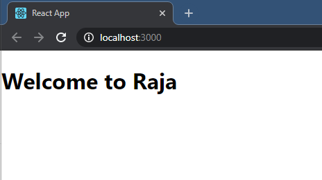

*********************
# ReactDocumentation
*******************
# States and Props
## Stats Definition:-
 * State is a special object that holds dynamic data, which means that state can change over time and anytime based on user actions or certain events.
 * State is private and belongs only to its component where defined, cannot be accessed from outside, but can be passed to child components via props.
 * State is initialized inside its component’s constructor method.
 * When a change in the state is made, state shouldn’t be modified directly. Instead, state updates should be made with a special method called setState( ).
 * State should not be overly-used in order to prevent performance problems.
## Creating The State:-
 * If you’re familiar with object-oriented programming, you know that there is a structure called class.
 * A class has a special method called constructor( ) and it is being called during object creation. We can also initialize our object properties or bind events inside the constructor( ).
 * The same rule applies to state. Since state is also an object, it should be initialized inside the constructor method:
### Small app in states:-
 * Start New project, open cmd your folder location and type cmd (npx create-react-app props)
 * Open project folder in the editor.
 * open src folder, and search app.js file, and open the App.js file default code remove, and add this code.
{

```
import React, { Component } from 'react';
class App extends React.Component {
 constructor() {
      super();
      this.state = { name: "Raja" };
      }
      render() {
              return (
                  <div>
                      <h1> Welcome to  { this.state.name }</h1>
                  </div>
              );
     }
}
export default App;
```
}
### Output:-
  * run the server 
  * enter your project folder and enter cmd (npm start)
  

## Props Definition:-
  * “Props” is a special keyword in React, which stands for properties and is being used for **passing data from one component to another**. But the important part here is that data with props are being passed in a **uni-directional flow**. (one way from parent to child) 

  * Further more, **props data is read-only**, which means that data coming from the parent should not be changed by child components. 
  * It is an object which stores the value of attributes of a tag and work similar to the HTML attributes. 
  * It is similar to function arguments. 
  * Props are **immutable** so we **cannot modify the props from inside the component**. Inside the components, we can add attributes called props. These attributes are available in the component as this.props and can be used to render dynamic data in our render method. 
  * **this.props.property name** => Passing parameters from one component to another component
 ## Using Props in React
 * I will be explaining how to use Props step by step.
  1. Firstly, define an attribute and its value(data)
  2. Then pass it to child component(s) by using Props
  3. Finally, render the Props Data

